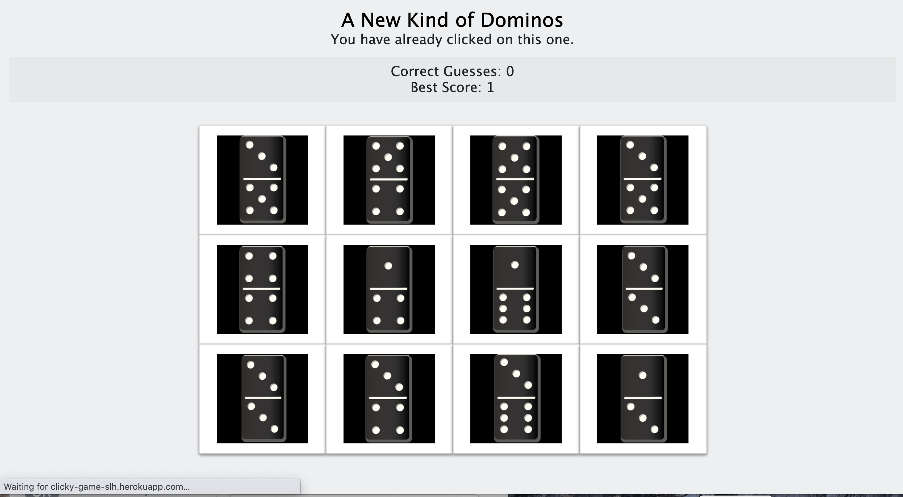

This is a React-based web application that allows users to click on a random domino, causing the software to reshuffle the arrangement. The goal of the game is to click on all 12 dominos without selecting the same one twice.

## Getting Started

To use this software, either clone or download and extract the files to a location of your choosing on your computer. To clone the repository, copy the clone link, open a terminal window and enter "https://github.com/seanhellier/clicky-game.git"

To prepare for use, first ensure that node.js is installed on your computer. To install node, visit [Node.org](https://nodejs.org/en/) and download the version appropriate to your computer.

After establishing the repository on your computer and node.js is installed, open a terminal and enter

    cd clicky-game
    npm install
    npm start

open http://localhost:3000/ in a browser

### Deployment

To deploy this software on a webserver, follow any instructions required by your Internet Hosting Providor (IHP) or server administrator.

## Built With

- [Node.js](https://nodejs.org/en/) - required
- [Bootstrap](https://getbbootstrap.com/) - Bootstrap extension used for element layout
- [Javascript](https://www.javascript.com/) - Used for app operation
- [jQuery](https://jquery.com/) - Used for app operation
- [React](https://reactjs.org/) - Used for app operation

## Contributing

Please read [CONTRIBUTING.md](https://github.com/seanhellier/slh_portfolio/blob/master/contributing.md) for details on the code of conduct, and the process for submitting pull requests to us.

## Versioning

We use [SemVer](http://semver.org/) for versioning. For the versions available, see the [tags on this repository](https://github.com/your/project/tags).

## Authors

- **Sean Leif Hellier** - _Initial work:_
  _ [Website](http://www.seanhellier.com)
  _ [Github](https://github.com/seanhellier/clicky-game) \* [Heroku](https://clicky-game-slh.herokuapp.com/)

## License

This project is licensed under the MIT License - see the [LICENSE.md](LICENSE.md) file for details

## Acknowledgments

Thank you, Ron Erlih for you guidance with this assignment. You are a great instructor.
